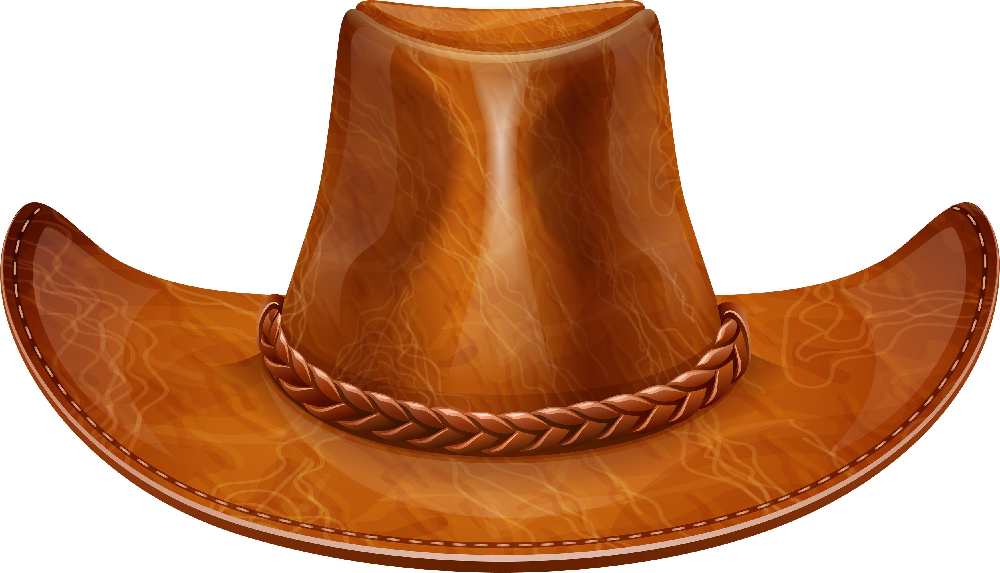

# Cuaderno 5 

Este Cuaderno muestra el desarrollo del quinto cuaderno de la asignatura, el cual incluye un único ejercicio.

### Pasos Previos

Antes de si quiera empezar hay que seccionarse de tener disponible 2 apartados fundamentales:

* Un entorno virtual creado con Python, opencv-python instalado (En este cuaderno se utilizará Anaconda).
* Todas estas librerías instaladas:

```
pip install imutils
pip install mtcnn
pip install tensorflow   
pip install deepface
pip install tf-keras
pip install cmake
pip install dlib
```

### Desarrollo

Para empezar dentro de nuestro cuaderno tendremos otras librerías instaladas:

```python
import cv2
import numpy as np

import tkinter as tk
```
 
* **OpenCV (cv2)**: Se utiliza para la captura y procesamiento de imágenes y video en tiempo real. En el cuaderno se usará para capturar videos de la cámara web y añadir figuras sobre frames. 

* **NumPy (np)**: Proporciona estructuras de datos eficientes. En el cuaderno se usa para manipular datos de las imágenes.

* **import tkinter as tk**: Esta librería importa Tkinter, que permite crear interfaces gráficas de usuario en Python. En este caso, se usa para construir una ventana con botones que permiten al usuario seleccionar diferentes modos o filtros visuales en la aplicación.


#### Tarea Única - Desarrollar un filtro 

La tarea consiste en desarrollar una aplicación interactiva que utiliza la cámara en tiempo real para aplicar diferentes filtros las caras detectadas en cámara. Usando clasificadores de detección de rostros y características faciales

El proyecto se estructura de la siguiente manera:

* Se desarrollarán 4 filtros únicos.

* Estos filtros se organizarán en un menú que permite seleccionar el filtro deseado mientras la cámara esté activa.

La implementación se compone de 5 bloques de código: 4 funciones que generan cada filtro y un archivo principal que configura el panel de control y administra la cámara.

El primer paso es desarrollar este archivo principal, que configura el panel de selección de modos y activa la cámara.

### Código Principal
---

El código comienza configurando los clasificadores Haar y cargando las imágenes que se utilizarán para cada filtro.

1. **Clasificadores Haar**:
   - `face_cascade`: Detecta caras.
   - `eyepair_cascade`: Detecta pares de ojos.
   - `nose_cascade`: Detecta la nariz.

2. **Carga de imágenes para filtros**:
   - **Sombrero** (`hat.png`)
   - **gafas** (`pngtree-wayfarer-sunglasses-with-black-frames-png-image_4487246.png`)
   - **Other face** (`pngimg.com - barack_obama_PNG39.png`): La imagen de una cara de referencia, puede ser cualquier cara mientras mantenga el formato “.png” con canal alpha (explicado abajo).
   ---
   - **peluca** (`peluca.png`)
   - **nariz roja** (`nariz roja.png`) 
   -  **mejillas** (`mejilla.png`) 

   
    Todas ellas se cargan usando `cv2.imread` con el modo `cv2.IMREAD_UNCHANGED` para conservar el canal alpha.

### Configuración de la ventana de selección de modos

Se configura una ventana usando `Tkinter` para seleccionar los diferentes filtros:


- Para ello se utilizan dos variables de control sobre el código:
  - `mode`: Almacena el modo de filtro actualmente.
  - `running`: Solo se utiliza para poder cerrar el código de manera efectiva.

- Esto se desarrolla en el menú teniendo 5 botones:
  - **4 Botones de filtros separado**: Permiten al usuario cambiar entre distintos filtros seleccionables (`Sombrero de Vaquero`, `Obama`, `Gafas`, `Payaso`), cada uno con un color distinto para diferenciarlos.
  - **Botón de cierre de cámara**: Un ultimo botón el cual solo permite cerrar la cámara, su motivo de existencia es ser mucho más rápido y conveniente.

### Bucle principal de captura de video y aplicación de filtros

El programa inicia la cámara y aplica el filtro correspondiente al frame actual. Se puede dividir este cuaderno de manera simplificada en 4 etapas.

- **Captura de video**: Se usa el bucle típico utilizado en anteriores cuadernos para capturar cada frame de la cámara
- **Detección de caras**: Convierte cada frame a escala de grises y detecta caras utilizando el clasificador `face_cascade`.
- **Aplicación de filtros**: Según el valor de `mode`, se utiliza un filtro u otro, llamando a una función específica y pasándole, el frame, lo necesario a poner en el filtro y la detección de la cara. 
- **Actualización y salida**:Por último, una vez el filtro haya terminado de aplicarse, devuelve el frame para aplicarlo sobre la cámara

Este flujo permite aplicar filtros en tiempo real sobre las caras detectadas, con la posibilidad de cambiar de filtro de forma interactiva.

### Filtros Implementados
---

- **`modo_sombrero`**: Este filtro coloca un sombrero sobre la cabeza de la persona.
- **`modo_cambio_de_caras`**: Superpone la cara de otra persona sobre la cara detectada.
- **`modo_gafas`**: Coloca unas gafas en los ojos
- **`modo_payaso`**: Añade elementos típicos de un disfraz de payaso, concretamente una peluca, una nariz roja y unas mejillas rojas.

Cada filtro introduce una nueva dificultad y agrega un desafío adicional. Se empieza con el sombrero, que es el filtro inicial y se enfoca en la detección de la parte superior de la cara. Luego, el cambio de caras abarca toda la cara. Las gafas plantean el reto de detectar y ajustar el filtro sobre ambos ojos, y finalmente, el filtro de payaso combina múltiples elementos, integrando varios filtros simultáneamente sobre diferentes partes de la cara.

#### Proceso General de Aplicación de Filtros

Cada filtro se desarrolla siguiendo una estructura similar para lograr una superposición precisa en el frame:
1. **Comprobación de tamaño mínimo**: Primero se verifica si el área de la cara detectada cumple con el tamaño mínimo necesario para aplicar el filtro.
2. **Ajuste de dimensiones**: La imagen a añadir como filtro se redimensiona para que se ajuste al tamaño de la cara detectada.
3. **Cálculo de posición**: Se calcula la posición exacta en el frame donde debe colocarse la imagen.
4. **Superposición de la imagen**: Finalmente, la imagen redimensionada se superpone sobre el frame. El frame luego se redimensiona para su visualización.

El único filtro que no hace estos pasos es el de payaso, y su variación no es muy distinta de los otros si se conoce el proceso. Ahora se va a explicar cada filtro poco a poco

    IMPORTANTE

        Es necesario que las imágenes para los filtros tengan un canal alpha porque este canal permite definir la transparencia de cada píxel. El canal alpha es un cuarto canal en una imagen que indica cuán opaco o transparente es cada píxel. 
        
        Esto es útil para superponer imágenes, ya que permite que solo los píxeles visibles del filtro se apliquen al frame, mientras que las áreas transparentes dejan ver la cara detrás sin cubrirlo.

* **EJEMPLO IMAGEN CON CANAL ALPHA**

<p align="center">
  
</p>

* **EJEMPLO IMAGEN SIN CANAL ALPHA (o en este caso con canal alpha falso)**

<p align="center">
  
</p>

### Sombrero
---
El filtro sombrero coloca un sombrero en la parte superior de la cara. Se seguirá el planteamiento descrito anteriormente:

1. **Comprobación del tamaño mínimo**: Verifica si la cara detectada cumple con el tamaño mínimo para aplicar el filtro.

2. **Redimensionamiento del sombrero**: El ancho del sombrero se ajusta para ser ligeramente mayor que la cara y, manteniendo la proporción, se calcula su altura. Esto garantiza que el sombrero esté bien dimensionado para la cara detectada.

3. **Cálculo de la posición**:

    Para colocar el sombrero correctamente sobre la cabeza, se realizan dos cálculos importantes:

- **Posición vertical (y_offset)**:

        Para situar el sombrero justo encima de la cabeza, se coloca la parte inferior del sombrero a la altura de la parte superior de la cara detectada.
        Se calcula restando la altura del sombrero (sombrero_resized.shape[0]) a la coordenada y de la cara
        Si esta posición sale del límite superior de la imagen (es negativa), se ajusta a cero para evitar que el sombrero se salga de la imagen.

- **Posición horizontal (x_offset)**:

        Para centrar el sombrero respecto a la cara, se calcula su posición horizontal restando la mitad de la diferencia entre el ancho del sombrero y el ancho de la cara. Esto alinea el sombrero simétricamente.
        También se asegura que x_offset no sea negativo, manteniéndolo dentro del borde izquierdo de la imagen.

4. **Superposición del sombrero**: La función recorre cada píxel del sombrero redimensionado y, si el sombrero contiene un canal alpha para transparencia, solo aplica los píxeles visibles (donde `alpha != 0`). Cada píxel se coloca en el frame únicamente si las coordenadas `y_offset + i` y `x_offset + j` están dentro de los límites de la imagen, lo que evita errores de superposición. 

<p align="center">
  
</p>

### Gafas
---

El filtro Gafas coloca unas gafas en los ojos detectados, se recalca **en los ojos no por separado, ambos ojos**. Nuevamente se seguirá el mismo planteamiento descrito anteriormente:

1. **Comprobación del tamaño mínimo**: Verifica si los ojos detectados cumple con el tamaño mínimo para aplicar el filtro, asegurando que no aparezcan gafas de forma espontanea por la cámara.

2. **Redimensionamiento de las gafas**: Calcula un ancho ajustado para las gafas, ligeramente mayor que el ancho de los ojos, y ajusta la altura manteniendo la proporción.

3. **Cálculo de la posición**: Se calcula la posición exacta para centrar las gafas sobre los ojos siguiendo los mismo pasos que con el sombrero sino que aquí no hay riesgo de que se salgan de la pantalla con tanta facilidad así que se ignora el problema

4. **Superposición del sombrero**: Por ultimo, se superpone las gafas sobre el frame en la posición calculada, utilizando el canal alpha para aplicar solo los píxeles visibles y lograr un ajuste natural sobre ambos ojos. Igual que con sombrero

<p align="center">
  
</p>

### Cambiador de caras
---

El filtro Cambiador de caras coloca la cara de otra persona pasada como parámetro, puede ponerse cualquier cara siempre en cuando este sobre un canal alpha. Nuevamente se seguirá el mismo planteamiento descrito anteriormente aunque algo cambiando ya que primero se debe de hablar de una nueva función:

---

#### Función `extraer_rostro`

Esta función detecta y extrae la cara de la imagen pasada por parámetro para prepararlo para su superposición en el filtro.

1. **Conversión a escala de grises**: Convierte la imagen de entrada a escala de grises 
2. **Detección de la cara**: Utiliza el clasificador Haar para detectar solo la cara. Si por algún casual no se detecta ninguna cara, devuelve una imagen completamente negra del mismo tamaño para evitar errores.

3. **Extracción de la cara**: Si se detecta una cara, la función extrae la región de la cara y se devuelve como resultado.

---
Una vez se tiene la cara del individuo con la imagen en si, se aplica sobre la cara detectada en frame siguiendo nuevamente la misma estructura

1. **Comprobación del tamaño mínimo de la cara**: La función recorre cada cara detectada y aplica el filtro solo si la cara cumple con el tamaño mínimo.

2. **Redimensionamiento de la cara de referencia**: Ajusta el tamaño de la cara de referencia para que coincida con el ancho y la altura de la cara detectada en el frame actual.

3. **Superposición de la cara con transparencia**: Se pone la imagen sacada por la función anterior sobre la cara detectada.

El ejemplo utiliza una imagen de Obama con canal alpha

<p align="center">
  
</p>

### Filtro de payaso
---

El filtro de payaso es el más complejo de todos porque combina múltiples elementos superpuestos (peluca, nariz roja y mejillas) y utiliza varias detecciones. A diferencia de los otros filtros, el filtro de payaso necesita coordinar la posición y tamaño de varios componentes en diferentes partes de la cara.

Primero se debe explicar una función aparte que es de vital importancia para este apartado.

#### overlay_image_alpha
---

La función `overlay_image_alpha` permite integrar varias imágenes sobre la cara detectada en el frame de la cámara, **manteniendo sus áreas transparentes**. En palabras más simple, permite poner cada elemento poco a poco en su respectiva posición sin alterar nada más.

La función toma cuatro parámetros: la imagen base (`img`), la imagen que se quiere superponer (`img_overlay`), la posición en la que debe colocarse (`pos`), y una máscara de transparencia (`alpha_mask`). 

Este último es el canal alpha de la imagen superpuesta, que controla la opacidad de cada píxel.

1. **Definición de la región de superposición**: Se determina la posición en la imagen base donde se colocará la imagen, definiendo una región de interés (`ROI`) en la imagen base que coincide con el tamaño de `img_overlay`.

2. **Aplicación de transparencia**: Para cada canal de color (BGR), la función combina los valores de `img_overlay` y la imagen base usando `alpha_mask`. Así:

    - Los píxeles opacos de `img_overlay` reemplazan los de la imagen base.
    - Los píxeles parcialmente transparentes se mezclan, creando una transición.
    - Los píxeles completamente transparentes permiten ver la imagen base sin alteraciones.

3. **Integración en la imagen base**: La función asegura que los elementos gráficos se coloquen solo donde corresponda, manteniendo sus áreas transparentes o semitransparentes. 

---
Una vez se entiende esta función se puede explicar el nuevo filtro el cual lo único que acaba haciendo es nuevamente lo mismo de antes, pero por secciones y aplicando la función de antes para la superposición de los elementos. Realmente lo que interesa es dividir lo que se va a añadir por secciones y ver unicamente sus características.

1. **Superposición de la peluca**:
    - La peluca se coloca en la parte superior de la cabeza detectada. 
    - Se ajusta para cubrir un área que sea aproximadamente **1.5 veces** el ancho de la cara y tenga una altura similar.
    - Las coordenadas de la peluca se calculan para colocarla justo por encima de la cara, sin salir del límite de la imagen.

2. **Detección y superposición de la nariz roja**:
    - Dentro del área de la cara detectada, se busca la región de la nariz utilizando el clasificador `nose_cascade`.
    - La imagen de la nariz roja se redimensiona para ser más grande y colocarse de manera un poco elevada sobre la nariz detectada
    - Se realiza una verificación de límites para evitar que la nariz roja salga de la región de interés o de la imagen principal.

3. **Superposición de las mejillas**:
    - Finalmente, se colocan dos imágenes de mejillas en ambos lados de la nariz. 
    - Las mejillas se redimensionan para ser proporcionales al ancho y altura de la cara detectada.
    - Se calcula la posición de cada mejilla a ambos lados de la nariz 
    - Se verifica que se superpongan correctamente sin salir de los límites.

<p align="center">
  
</p>

## DEMOSTRACIÓN ANIMADA DE TODOS LOS FILTROS


